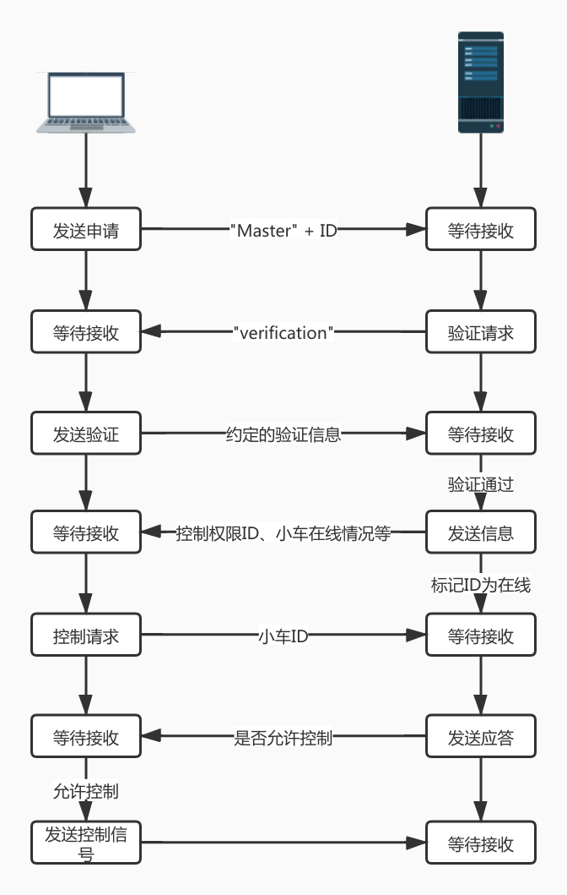
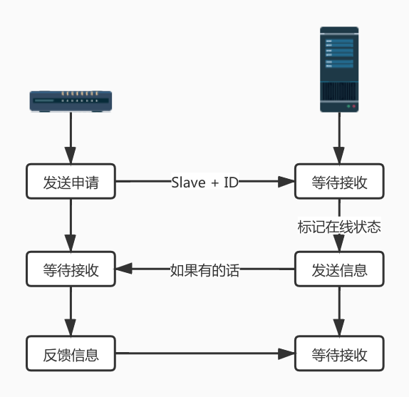

## Target Recognition and Tracking Smart Car System

[Github主页](https://github.com/Malloc-Luo/SmartCar)

### 0. 系统结构

实现一个目标识别跟踪智能小车系统。智能小车可以PC端的客户端远程控制、识别手势做出规定动作或者跟踪特定的目标物体，小车相机采集到的图像还可以实时显示在PC客户端。


### 1. 小车速度定义

小车速度由3个速度合成：

* 前后方向：Fore Back，记为y方向，速度$v_y$，前为正
* 左右方向：Left Right，记为x方向，速度$v_x$，右为正
* 旋转：Rotate，记为r方向，速度$\omega_r$，逆时针为

速度解算参考：https://blog.csdn.net/banzhuan133/article/details/69229922

设四个轮速度分别为$v_{1}\ \ v_2\ \ v_3\ \ v_4$（以右上为起点逆时针编号），则：
$$
\left\{\begin{array}{}v_1 = -v_y - v_x + \omega\\
v_2 = +v_y - v_x + \omega\\
v_3 = +v_y + v_x + \omega\\
v_4 = -v_y + v_x + \omega \end{array}\right.
$$

### 2. Raspberry Pi & STM32

串口通信，波特率9600，奇校验。Raspberry Pi会向stm32发送控制数据，stm32根据自己的模式选择使用哪些数据；stm32向Raspberry Pi发送选择模式信号，让其进入跟踪模式（`Track`）或者识别模式（`Identify`）。

#### 2.1 raspberry pi -> stm32

| 数据段  |     描述     | 长度/byte |
| :-----: | :----------: | :-------: |
|  [0:7]  | Frame Header |     1     |
| [8:15]  |   手势动作   |     1     |
| [16:31] |  x方向速度   |     2     |
| [32:47] |  y方向速度   |     2     |
| [48:63] |   旋转分量   |     2     |

```c++
#pragma pack(1)
typedef enum {
    Fore, Back, Left, Right, Rotate
} Action;

typedef struct {
	uint8_t header;
    Action action;
    int16_t speedx;
    int16_t speedy;
    int16_t speedr;
} Raspberry2STM_t;
```

#### 2.2 stm32 -> raspberry pi

| 数据段 |   描述   | 长度 |
| :----: | :------: | :--: |
| [0:8]  | 模式选择 |  1   |

```c++
#pragma pack(1)
typedef enum {
	Remote, Track, Identify    
} Mode;

typedef struct {
    Mode mode;
} STM2Raspberry_t;
```

### 3. STM32 & ESP8266

串口通信，波特率9600，奇校验。ESP8266的任务是充当STM32与服务器之间的信号中转，与服务器进行socket通信获取的数据转发到串口；串口收到的数据转发到socket。

#### 3.1 stm32 -> esp8266

| 数据段  |     描述     | 长度 |
| :-----: | :----------: | :--: |
|  [0:7]  | Frame Header |  1   |
| [8:23]  | 轮1实际速度  |  2   |
| [24:39] | 轮2实际速度  |  2   |
| [40:55] | 轮3实际速度  |  2   |
| [56:71] | 轮4实际速度  |  2   |

```c++
#pragma pack(1)
typedef struct {
    uint8_t header;
    int16_t speed1;
    int16_t speed2;
    int16_t speed3;
    int16_t speed4;
} STM2Esp_t;
```

#### 3.2 esp8266 -> stm32

| 数据段  |     描述     | 长度 |
| :-----: | :----------: | :--: |
|  [0:7]  | Frame Header |  1   |
| [8:15]  |   控制模式   |  1   |
| [16:31] |  x方向速度   |  2   |
| [32:47] |  y方向速度   |  2   |
| [48:63] |    r速度     |  2   |
| [64:71] |   在线状态   |  1   |

```c++
#pragma pack(1)
typedef enum {
    Remote, Track, Identify
} Mode;

typedef struct {
    uint8_t header;
    Mode mode;
    int16_t speedx;
    int16_t speedy;
    int16_t speedr;
    uint8_t isonline;
}Esp2STM_t;
```

### 4. PC Client & Server & ESP8266

PC到服务器：`39.106.216.248:10000`；Esp8266到服务器：`39.106.216.248:10001`

到服务器的通信的格式：

|  数据段  |    描述    | 长度 |
| :------: | :--------: | :--: |
|  [0:7]   | 数据报标识 |  1   |
| [8:8n+7] |    数据    |  n   |

数据报标识描述了该帧数据的作用，具体如下：

```c++
typedef enum {
    Apply, Verifice, Signin, Control
} Flag_t;
```

#### 4.1 PC -> Server

PC进行控制前需要在服务器进行注册验证，以获取控制权限，注册验证流程如下：



每台PC在初始化之初都有一个唯一的ID，用于标识设备。流程描述如下：

1. PC客户端先向服务器发送申请信号（`Apply`阶段），格式为`"master" + ID`，服务器接收到后会发送一个验证请求。
2. PC发送验证信息至服务器（这一步其实可以没有，直接通过`ID`验证），服务器发送当前小车的在线情况并将PC标记为在线；如果当前没有小车在线，服务器会一直发送在线情况，PC产生一个应答信号；一段时间没有应答信号产生则标记PC为离线。
3. PC选择要控制小车的ID（`Sigin`）阶段，进行注册；若当前小车空闲，则赋予PC控制权限，返回允许控制；否则返回不允许控制。
4. 若PC获取到允许控制信号，则可以向服务器发送控制信号及接受控制信号。

控制信号格式同3.2 esp8266 -> stm32控制信号，但略有变化：

```c++
#pragma pack(1)
typedef struct {
    Flag_t flag;
    uint32_t masterId; /* 自己的ID */
    uint32_t slaveId;  /* 控制小车的ID */
    Mode mode;
    int16_t speedx;
    int16_t speedy;
    int16_t speedr;
} ControlFrame_t;
```

服务器发送到PC的反馈信号：

```c++
#pragma pack(1)
typedef struct {
    uint8_t online;
    uint32_t slaveId;
    int16_t speed1;
    int16_t speed2;
    int16_t speed3;
    int16_t speed4;
} FeedbackFrame_t
```

#### 4.2 Esp8266 -> Server

Esp8266也需要在服务器进行注册验证才能接受控制信号，流程如下：



* ESP8266先向服务器发送申请，格式为`"slave" + ID`，服务器接到后将其标记为在线状态；
* 服务器向其转发控制信号（包含PC在线状态），如果没有实际控制信号的话默认为0；esp8266收到后发送反馈信号；一段时间内没有反馈信号产生则认为其离线

Esp8266向服务器发送：

```c++
#pragma pack(1)
typedef struct {
    uint32_t slaveId;
    int16_t speed1;
    int16_t speed2;
    int16_t speed3;
    int16_t speed4;
} FeedbackData_t;
```

服务器向Esp8266发送：

```c++
#pragma pack(1)
typedef struct {
    uint8_t online;
    uint32_t masterId;
    Mode mode;
    int16_t speedx;
    int16_t speedy;
    int16_t speedr;
} ControlData_t;
```

### 5. 组内分工

|  成员  | 分工                                                         |
| :----: | :----------------------------------------------------------- |
| 孙玺淳 | Esp8266软件(Arduino IDE, C++, 串口通信, Socket)              |
| 陈敬煌 | STM32软件(Keil, C, 串口通信, PID算法, DAC, DMA)              |
| 李昱棋 | PC客户端(Qt, C++, Socket); 服务器(C++, Socket, Rtmp); 树莓派(串口通信, Rtmp) |
| 刘梦泽 | 手势识别(OpenCV, Tensorflow, Python); 树莓派(深度学习环境搭建) |
| 杨博然 | 物体识别(Opencv, Python)                                     |

#### 5.1 STM32软件部分

负责小车的运动控制，包括麦克纳姆轮速度解算、电机速度获取、PID算法、与树莓派串口通信、与ESP8266串口通信等。

#### 5.2 树莓派

树莓派主要用于视觉识别，与STM32之间串口通信。树莓派需要根据要求识别手势（几种特定的手势）、识别物体（乒乓球，计算其画面中位置、图像面积），还有目标跟踪算法；另外有精力的话可以做一下Rtmp视频推流。

#### 5.3 ESP8266软件

ESP8266作为STM32的Wi-Fi模块，将串口收到的数据通过Socket转发；将Socket收到的数据通过串口转发。

#### 5.4 PC客户端

PC客户端用于远程控制，在客户端获取键盘输入，转换成控制信号发送至服务器；如果有精力的话，可以做一个Rtmp客户端，接收视频推流。

#### 5.5 服务器端软件

服务器端是一个UDP服务器，主要作用是建立PC客户端与智能小车之间的虚拟连接、转发控制信号等；如果有精力的话还可以部署一下Rtmp服务器，用于转发视频推流。


