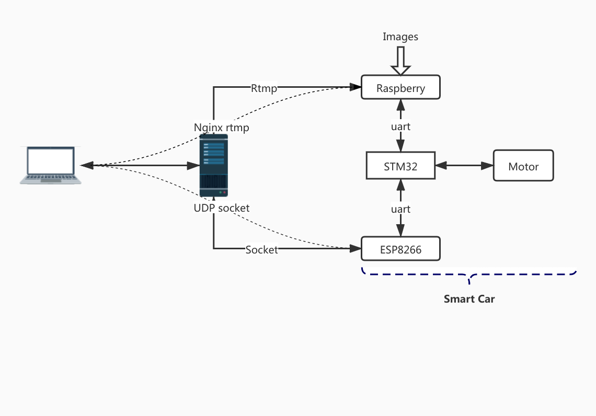

## Target Recognition and Tracking Smart Car System

[Github主页](https://github.com/Malloc-Luo/SmartCar)

### 0. 系统结构

实现一个智能无人车系统。智能小车可以PC端的客户端远程控制、识别手势做出规定动作或者跟踪特定的目标物体，小车相机采集到的图像还可以实时显示在PC客户端。



### 1. 小车速度定义

小车速度由3个速度合成：

* 前后方向：Fore Back，记为y方向，速度$v_y$，前为正
* 左右方向：Left Right，记为x方向，速度$v_x$，右为正
* 旋转：Rotate，记为r方向，速度$\omega_r$，逆时针为

速度解算参考：https://blog.csdn.net/banzhuan133/article/details/69229922

设四个轮速度分别为$v_{1}\ \ v_2\ \ v_3\ \ v_4$（以右上为起点逆时针编号），则：
$$
\left\{\begin{array}{}v_1 = -v_y - v_x + \omega\\
v_2 = +v_y - v_x + \omega\\
v_3 = +v_y + v_x + \omega\\
v_4 = -v_y + v_x + \omega \end{array}\right.
$$

### 2. Raspberry Pi & STM32

串口通信，波特率115200，无校验。Raspberry Pi会向stm32发送控制数据，也就是自己识别到的手势。一共三个结果：

| 信号     | 手势                   |
| -------- | ---------------------- |
| 0 (char) | 未识别到手势 或者 stop |
| 1 (char) | 手势1                  |
| 2 (char) | 手势2                  |

### 3. STM32 & ESP8266

串口通信，波特率115200，无校验。ESP8266的任务是充当STM32与服务器之间的信号中转，与服务器进行socket通信获取的数据转发到串口；串口收到的数据转发到socket。

#### 3.1 stm32 -> esp8266

每台小车有一个自己的ID及名称name，设备类型为slave，假设四个轮的速度分别为v1, v2, v3, v4，则发送的数据为：`slave+ID+name+v1,v2,v3,v4`

#### 3.2 esp8266 -> stm32

即服务器发来的控制信号，为一个长度为30的字符串，格式如下：

`<mode>,<vx>,<vy>,<vr>++++`

`mode`为`1`代表远程控制模式，否则代表手势识别模式；`vx`，`vy`，`vr`代表三个方向的速度；`+`为填充字符，将字符串填充至长度为30——为了配合`stm32`端的DMA接收。`stm32`解析字符串程序实例：

```c
void parse_control_data(const char data[]) {
    uint8_t len = strlen(data), index = 0;
    int8_t v[4] = {0, 0, 0, 0};
    uint8_t cnt = 0;
    while (data[index] == '+') { 
        index++; 
    }
    while (index < len && data[index] != '+') {
        bool sig = false;
        while (data[index] != ',' && data[index] != '+') {
            if (data[index] == '-') {
                sig = true;
            } else {
                v[cnt] = v[cnt] * 10 + (data[index] - '0');
            }
            if (++index == len) {
                break;
            }
        }
        index++;
        if (sig) {
            v[cnt] *= -1;
        }
        cnt++;
    }
}

```

### 4. PC Client & Server

PC到服务器：`39.106.216.248:19500`；Esp8266到服务器：`39.106.216.248:19501`

到服务器的通信的格式：`master+<ID>+<name>+<cmd>+[<data>]`

其中`cmd`包括：

| 命令       | 含义     | 返回                                 |
| ---------- | -------- | ------------------------------------ |
| requests   | 登记     | 返回在线设备列表                     |
| connect    | 请求连接 | 同意返回`OK`，否则返回`Fail`         |
| control    | 控制请求 | 成功返回小车反馈数据，否则返回`Fail` |
| disconnect | 断开连接 | 返回`OK`                             |


### 5. 组内分工

|  成员  | 分工             |
| :----: | :--------------- |
| 孙玺淳 |                  |
| 陈敬煌 | STM32软件        |
| 李昱棋 | PC客户端，服务器 |
| 刘梦泽 | 手势识别         |
| 杨博然 | 物体识别         |

#### 5.1 STM32软件部分

负责小车的运动控制，包括麦克纳姆轮速度解算、电机速度获取、PID算法、与树莓派串口通信、与ESP8266串口通信等。

#### 5.2 树莓派

树莓派主要用于视觉识别，与STM32之间串口通信。树莓派需要根据要求识别手势（几种特定的手势）、识别物体（乒乓球，计算其画面中位置、图像面积），还有目标跟踪算法；另外有精力的话可以做一下Rtmp视频推流。

#### 5.3 ESP8266软件

ESP8266作为STM32的Wi-Fi模块，将串口收到的数据通过Socket转发；将Socket收到的数据通过串口转发。

#### 5.4 PC客户端

PC客户端用于远程控制，在客户端获取键盘输入，转换成控制信号发送至服务器；如果有精力的话，可以做一个Rtmp客户端，接收视频推流。

#### 5.5 服务器端软件

服务器端是一个UDP服务器，主要作用是建立PC客户端与智能小车之间的虚拟连接、转发控制信号等；如果有精力的话还可以部署一下Rtmp服务器，用于转发视频推流。


